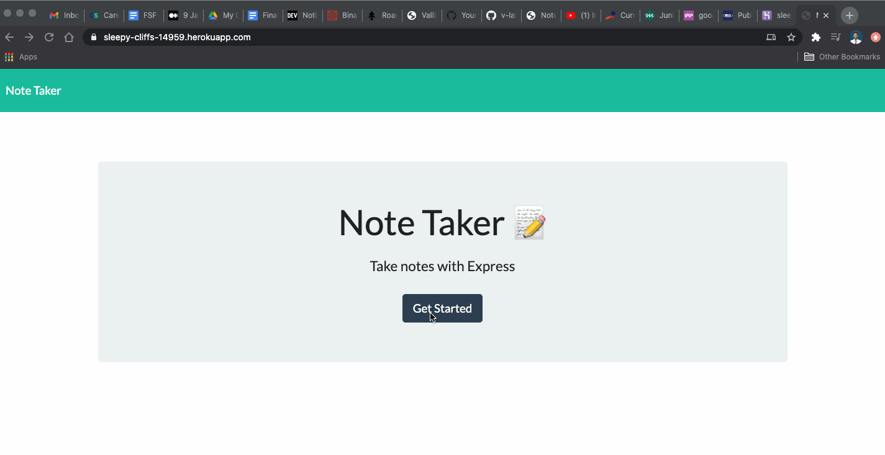

# Express_note_taking_app
An express app that can be used to write, create, save, and delete notes. 

# Table of contents

* [Tech used](#Tech%20used)
* [Usage](#Usage)
* [Questions](#Questions)

# Tech used 
* Node/npm
* Express.js 
* Heroku 
* Modular Javascript
* Node File System module
* Bootstrap

# Usage 
Using the app is pretty simple. Start typing out a note and once your finished adding text, the save button will pop up. Once you click on the save button, your note gets saved on the backend. You can add as many notes as you like, and when you are ready you can also delete any note you want as well. 

You can use the app by clicking [here]()

# Questions

Still confused? Think there is a better way I can write my code? Did I miss a key part of functionality? Let me know! Just drop me message on github.